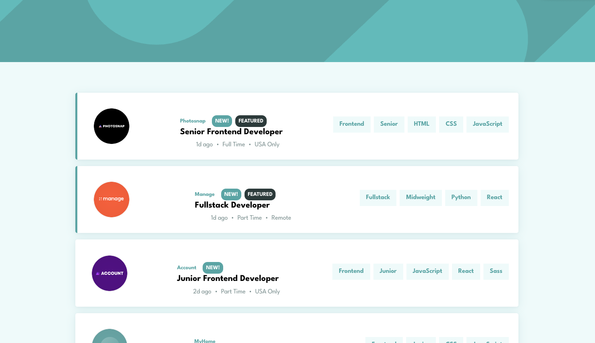
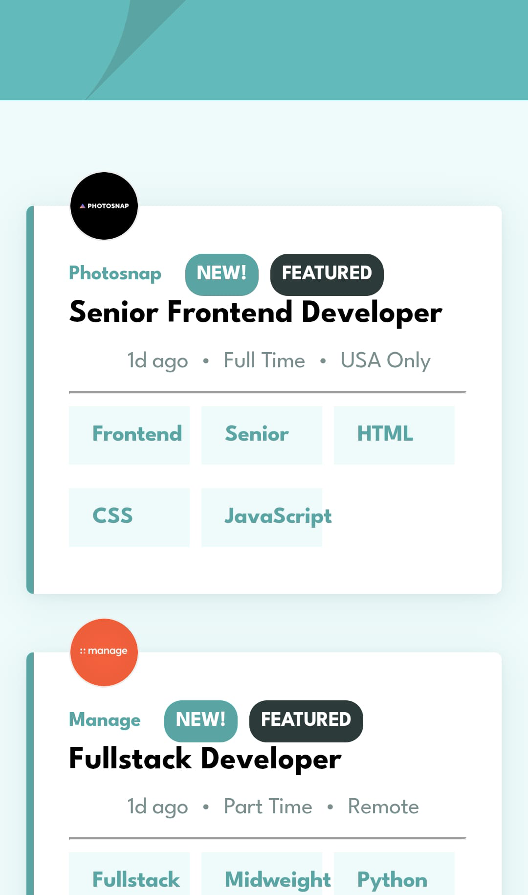

# Job Listings with Filtering

This is a solution to the [Job listings with filtering challenge on Frontend Mentor](https://www.frontendmentor.io/challenges/job-listings-with-filtering-ivstIPCt). The goal is to build a responsive job listing app where users can filter jobs by categories.

## Table of Contents

- [Design preview](#design-preview)
- [Demo](#demo)
- [Overview](#overview)
- [Features](#features)
- [Getting Started](#getting-started)
- [Built With](#built-with)
- [Directory Tree](#directory-tree)
- [Acknowledgments](#acknowledgements)

## Design Preview

### Large Screen Preview



---

### Mobile Screen Preview



## Demo

Here you can find the working [live demo](https://furkanssarri-job-listings-with-filter.netlify.app/).

## Overview

Users can:

- View a responsive layout for job listings
- See hover states for interactive elements
- Filter job listings by category (e.g., role, level, languages, tools)

## Features

- Dynamic filtering of job listings
- Responsive design for mobile and desktop
- Built with React and Vite for fast development

## Getting Started

To run the project locally:

```sh
npm install
npm run dev
```

## Built With

This project is built with the following technologies:

- Semantic HTML5 markup
- CSS custom properties
- Flexbox
- CSS Grid
- Mobile-first workflow
- [React](https://reactjs.org/) - JS library
- [Vite](https://vite.dev/) - Bundler

## Directory Tree

```text
src/
├── App.jsx
├── index.css
├── main.jsx
├── assets/
│   └── LeagueSpartan-VariableFont_wght.ttf
├── components/
│   ├── Filterbar.jsx
│   ├── Footer.jsx
│   ├── Header.jsx
│   ├── JobCard.jsx
│   ├── JobDetails.jsx
│   ├── JobTags.jsx
│   └── Main.jsx
├── data/
│   └── data.json
├── styles/
│   ├── _base.css
│   ├── components.css
│   └── utilities.css
```

## Acknowledgements

- Challenge by: [frontend-mentor](https://www.frontendmentor.io/)

[↑ back to top](#job-listings-with-filtering)
